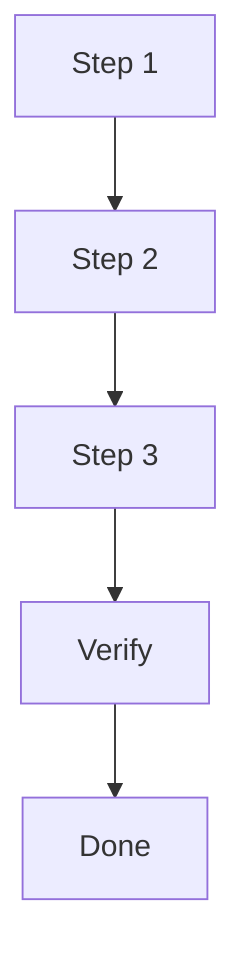

# Plan

## Goal

{{what will be delivered}}

## Scope

- In: {{included work}}
- Out: {{excluded work}}

## Execution Flow

> Keep this diagram only if it improves readability.

## Steps

1. {{step one}}
2. {{step two}}
3. {{step three}}

## Verification

- {{test, check, or manual validation}}

## Risks

- {{risk or none}}

## Handoff Notes

{{anything build or review needs to know}}
