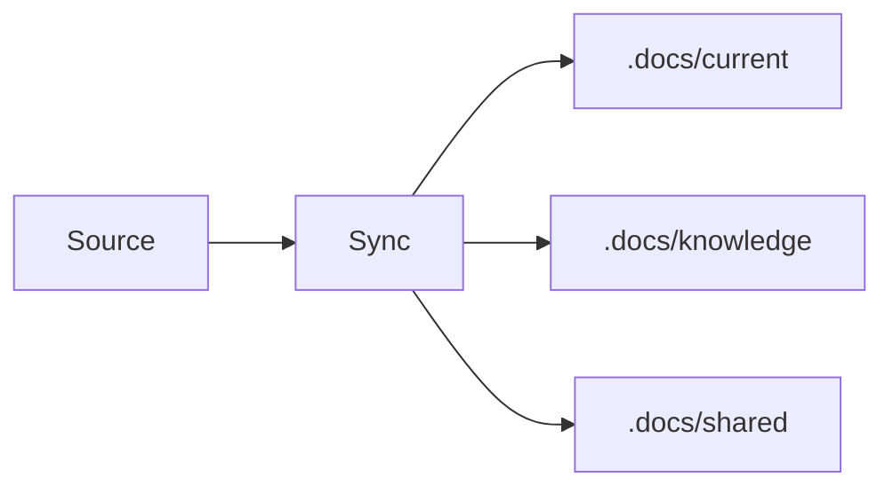

# Sync

## Source

{{code, change, raw material, or doc source}}

## Sync Flow

> Optional. Add a Mermaid diagram only when it makes the sync path easier to audit.

## Updates

- {{updated document and reason}}

## Durable Facts

- {{fact promoted to current or shared knowledge}}

## Removed Drift

- {{stale or conflicting information removed}}

## Follow-ups

- {{next action or none}}
